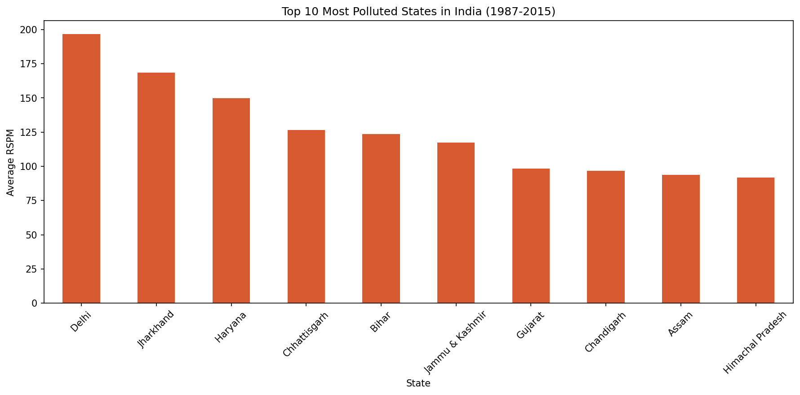

# India Air Quality EDA (1987–2015)

## Dashboard Preview

## Project Overview
Exploratory Data Analysis on India Air Quality 
dataset containing pollution readings across 
23 Indian states from 1987 to 2015. Analyzed 
key pollutants including RSPM, PM2.5, SO2, 
NO2, and SPM to uncover pollution patterns.

## Tools Used
- Python (Pandas, NumPy) — data cleaning
- Matplotlib & Seaborn — visualizations
- Folium — interactive India map

## Key Insights Found
- Delhi is the most polluted state with 
  avg RSPM of 196.64
- West Singhbhum is the most polluted city 
  with avg RSPM of 246.42
- December is the most polluted month 
  with avg RSPM of 112.66
- Winter months (Dec, Jan, Feb) consistently 
  show highest pollution levels
- PM2.5 has the strongest correlation with 
  RSPM (0.835) — most dangerous pollutant

## Visualizations
- Bar chart — Top 10 polluted states
- Line chart — Monthly pollution trend
- Line chart — Yearly pollution trend
- Heatmap — Pollutant correlation
- Interactive map — India city pollution map

## Dataset
- Source: India Air Quality Data (Kaggle)
- Records: 435,742 rows
- Period: 1987 — 2015
- States covered: 23

## Author
Harshitha Guntha
B.Tech CSE — Artificial Intelligence
SVR Engineering College
GitHub: github.com/Harshi3135
